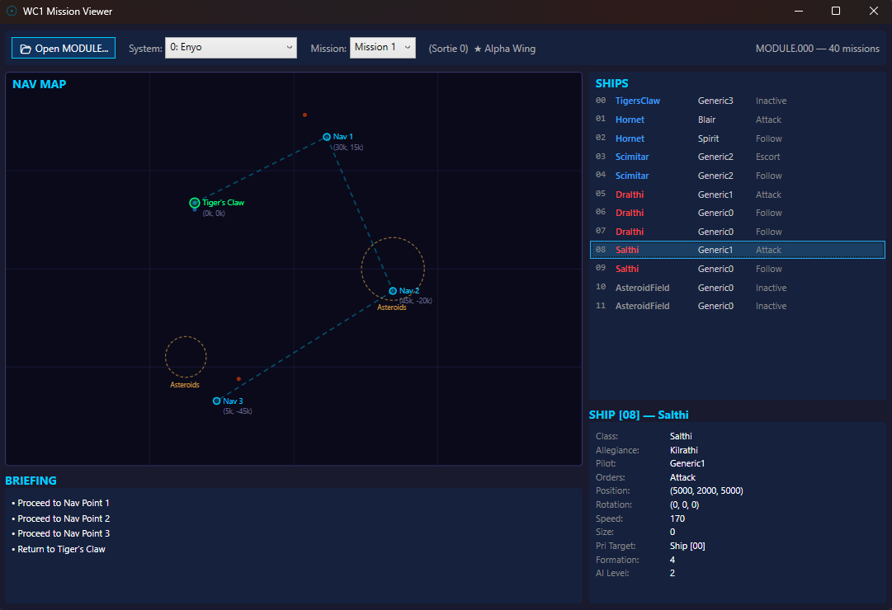

# WC Mission Viewer

A WPF desktop application that visually displays Wing Commander 1 & 2 mission data. Auto-detects the game type from the MODULE file header and adapts the UI accordingly.



## How to Run

```bash
cd WCMissionViewer && dotnet run
```

Then click **Open MODULE...** and select any MODULE file (`MODULE.000`, `.001`, or `.002` from either WC1 or WC2).

## Features

- **WC1 & WC2 support** -- auto-detects game type, dynamically updates title and labels, uses unified viewer models to display both formats
- **System/mission selectors** -- dropdown menus with star system names parsed from the MODULE file (WC2 system 0 metadata is filtered from the UI)
- **Wing/mission labels** -- displays wing name (WC1, e.g., "Alpha Wing") or mission label (WC2, e.g., "Mission A") alongside the sortie number
- **Nav Map** -- 2D plot of nav points on X/Z plane with dashed route lines, ship position dots (blue=Confed, red=Kilrathi), carrier nav points in green; click any nav marker or label for details
- **Nav types** -- dominant nav points shown at full opacity; manipulated (hidden) and follow-up encounters dimmed to 45% to reflect their in-game visibility
- **Carrier detection** -- carrier nav points (Tiger's Claw in WC1, Concordia/Caernarvon in WC2) detected by ship assignment, shown as larger green markers
- **Asteroid/Mine fields** -- dashed rings (amber=asteroids, red=mines) scaled proportionally to the field's size value; expansion-specific class IDs (SO1: 41/42, SO2: 51/52) are automatically mapped to the correct hazard type based on MODULE file number
- **Overlapping nav points** -- multiple nav points at the same coordinates share a single marker with stacked name labels and a single coordinate display
- **Selection highlighting** -- clicking a nav point turns its label, coordinates, and marker yellow; all labels are clickable
- **Encounter points** -- smaller orange markers to distinguish from named nav waypoints
- **Responsive layout** -- minimum window size (850x550), map redraws on resize, font/marker sizes scale with window dimensions (0.8x-2.0x)
- **Ship List** -- all ships color-coded by faction; shows pilot (WC1) or character (WC2) names
- **Briefing Panel** -- map objective text (WC1) or flight plan entries (WC2)
- **Detail Panel** -- full field breakdown for selected ship or nav point, including trigger semantics, briefing notes, preload classes, and ship indices

## UI Layout

The viewer uses a dark theme with the following layout:

- **Top bar** -- file open button, system dropdown, mission dropdown, wing assignment label
- **Left panel** -- nav map (2D X/Z plot with route lines and markers)
- **Right panel** -- ship list (color-coded by faction), briefing text, and detail panel for selected items

## Technical Notes

- Dark title bar applied via Windows DWM API
- Custom application icon (`app.ico`)
- Minimum window size enforced at 850x550
- Font and marker sizes scale proportionally with window dimensions (0.8x-2.0x range)